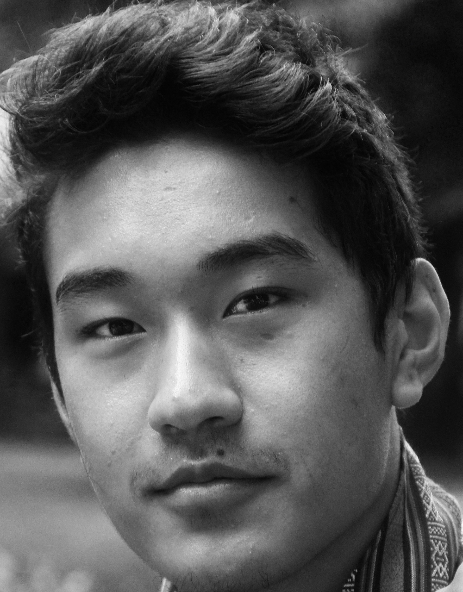

```{r setup, include=FALSE}
knitr::opts_chunk$set(echo = FALSE)
```

{width=100}

## About me: 

<br> I am currently a college student in Minnesota, USA. I'm originally from the Himalayan Kingdom of Bhutan where I spent the first 16 years of my life. After graduating from middle school, I went on to pursue my high school education in Costa Rica where I spent two years. I am a big fan of Basketball and my favorite team is the Los Angeles Lakers. I like to spend my time playing E-sports, watching TV shows such as Rick and Morty as well as spending time with family and friends 

## Education and Experience:

<br> I spent the first 16 years of my life studying in Bhutan where I was taught a wide range of subjects based on the Standard Indian Curriculum which allowed me to simulataneously learn English and Dzongkha (my native language). After graduating from middle school, I won a scholarship to the United World College of Costa Rica to continue my high school education where I completed the International Baccalaureate Diploma Program with concentrations in Economics and Psychology. 

<br> Currently, I am a senior at Macalester College where I am majoring in Economics, with a focus in finance. After completing my first year, I interned with AWPL in Bhutan over the summer whereby I was tasked with conducting research and analysis of the company's performance in foreign markets from a strategic and business development perspective. The summer of my sophomore year, I had the opportunity to intern with the Central Bank of Bhutan to analyze the financial position and stability of financial institutions in Bhutan as a result of COVID-19 and its impacts on the larger economy. These two experiences gave me a unique understanding of Economics and Business in Bhutan at both a micro and macro level. The summer before my senior year, I interned with Constellation Mutual, a Medical Professional Liability insurance company in Minnesota where I was a part of their Coporate Development team. My roles included conducting market research, valuations, preparing financial models, and due diligence for potential M&A transactions. 